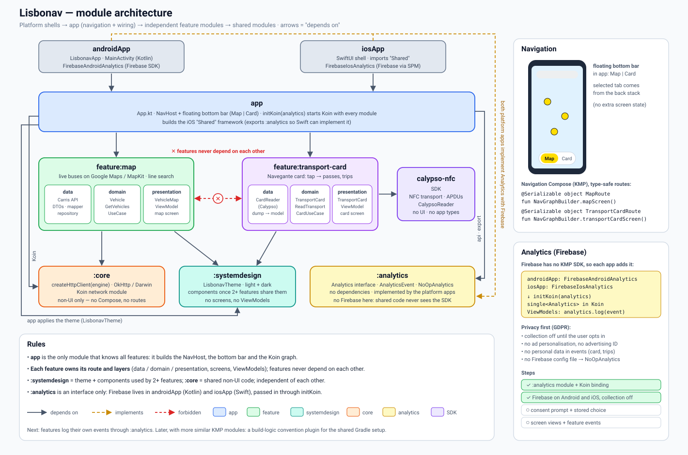
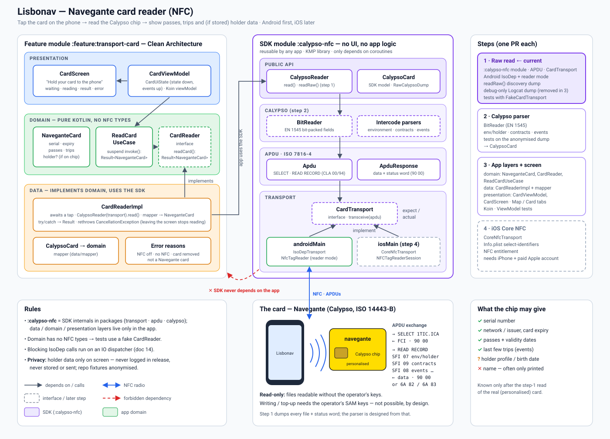

# Lisbonav

A Kotlin Multiplatform app for getting around Lisbon, for **Android and iOS** from one shared codebase.

- **Live bus map:** real-time positions of Carris Metropolitana buses on a map, with a search bar
  to show only one line.
- **Navegante card reader** *(planned)*: read Lisbon's contactless transit card over NFC
  (Calypso) and show its passes and recent trips.

> Work in progress. See the [roadmap](#roadmap) for what's done.

## Tech stack

| Concern | Library |
|---|---|
| Shared code | Kotlin Multiplatform (Android + iOS) |
| UI | Compose Multiplatform |
| Map | Google Maps (Maps Compose) on Android, Apple MapKit on iOS |
| Networking | Ktor (OkHttp engine on Android, Darwin on iOS) |
| JSON | kotlinx.serialization |
| Dependency injection | Koin |
| Tests | kotlin.test, kotlinx-coroutines-test, Ktor `MockEngine` |

## Data source

[Carris Metropolitana open data](https://github.com/carrismetropolitana): `GET https://api.carrismetropolitana.pt/v2/vehicles`

- Public, **no API key** needed.
- Returns all vehicles in service in one JSON array (no pagination); responses are cached for 5 s.

## Architecture

Clean Architecture with dependencies pointing inward:

```
presentation ──► domain ◄── data
                   ▲
                   di (Koin wires everything together)
```

```
shared/src/
├── commonMain/…/lisbonav/
│   ├── domain/
│   │   ├── model/            # Vehicle, GeoPoint, VehicleStatus (plain Kotlin)
│   │   ├── repository/       # VehicleRepository interface
│   │   └── usecase/          # GetVehiclesUseCase: hides buses 5+ min behind the rest of the feed
│   ├── data/
│   │   ├── remote/           # Ktor API client, DTOs, HttpClient factory
│   │   ├── mapper/           # DTO → domain (drops vehicles without a usable position)
│   │   └── repository/       # VehicleRepositoryImpl: errors returned as Result
│   ├── presentation/
│   │   ├── viewmodel/        # VehicleMapViewModel: polls every 10 s while the map is visible
│   │   └── ui/map/           # VehicleMapScreen (shared) + expect VehicleMap
│   └── di/                   # Koin modules, initKoin()
├── androidMain/…/            # OkHttp engine, Google Maps VehicleMap
└── iosMain/…/                # Darwin engine, MapKit VehicleMap, initKoinIos() for Swift
calypso-nfc/                  # SDK: read Calypso transit cards over NFC (no UI, no app types)
├── commonMain/               # CardTransport, APDUs (ISO 7816-4), CalypsoReader
└── androidMain/              # IsoDep transport, NFC reader mode (iOS Core NFC later)
androidApp/                   # Android entry point (LisbonavApp starts Koin)
iosApp/                       # iOS entry point (iOSApp.swift starts Koin)
```

- The **engine** is the only platform-specific networking piece. JSON, base URL and error
  handling are Ktor plugins in common code, so both platforms behave the same.
- Every API sits behind an **interface**, so the repository and ViewModels can be tested with fakes.
- **`:calypso-nfc`** is a separate SDK module: the app depends on it, never the other way round.
  It is read-only by design (writing to a card needs the operator's keys).

### Module structure (planned)

The app is moving to feature modules, so new screens stay independent: `app` holds the
navigation (bottom bar Map | Card) and wiring, each feature keeps its own data / domain /
presentation, and `core` only shares technical pieces.



### Card reader (NFC)

How the Navegante card reader is split between the app's layers and the `:calypso-nfc` SDK,
how the phone talks to the card (APDUs over NFC), and the steps to build it:



## Setup: Google Maps key (Android only)

iOS uses MapKit and needs no key. On Android, the map stays empty without a Google Maps key
(the app still builds and runs).

1. In [Google Cloud Console](https://console.cloud.google.com/), enable **Maps SDK for Android**
   and create an API key (a billing account is required; map loads in the Android SDK are free).
2. Restrict the key to **Android apps**: package `com.majidbahmani.lisbonav` and your signing
   certificate SHA-1 (`./gradlew :androidApp:signingReport`), and to the Maps SDK for Android API.
3. Add it to `local.properties` (gitignored, never committed):

       MAPS_API_KEY=your_key_here

   CI can set a `MAPS_API_KEY` environment variable instead.

A key inside an APK is not secret; the Android restriction is what protects it from misuse.

## Build & run

Requirements: Android Studio (with the Kotlin Multiplatform plugin), JDK 21 (requested by
`gradle/gradle-daemon-jvm.properties`), and Xcode for iOS.

```bash
# Android
./gradlew :androidApp:assembleDebug

# iOS: open iosApp/iosApp.xcodeproj in Xcode and run, or build from the command line
./gradlew :shared:linkDebugFrameworkIosSimulatorArm64
```

## Tests

Shared tests run on both platforms, without network access:

```bash
./gradlew :shared:testAndroidHostTest      # Android (JVM)
./gradlew :shared:iosSimulatorArm64Test    # iOS simulator
./gradlew :calypso-nfc:testAndroidHostTest :calypso-nfc:iosSimulatorArm64Test   # card SDK
```

## Roadmap

- [x] Vehicles API client and DTO (Ktor + kotlinx.serialization)
- [x] Dependency injection (Koin, platform HTTP engines)
- [x] Domain model, mapper and repository
- [x] ViewModel and map screen with live bus positions
- [ ] Request logging (debug only) and timeouts
- [ ] CI (GitHub Actions)
- [ ] Navegante card reader (NFC, Android first)
  - [x] `:calypso-nfc` SDK: transport, APDUs, raw read of a Calypso card
  - [ ] Calypso parser (passes, trips, holder data where readable)
  - [ ] Card screen in the app
  - [ ] iOS Core NFC
