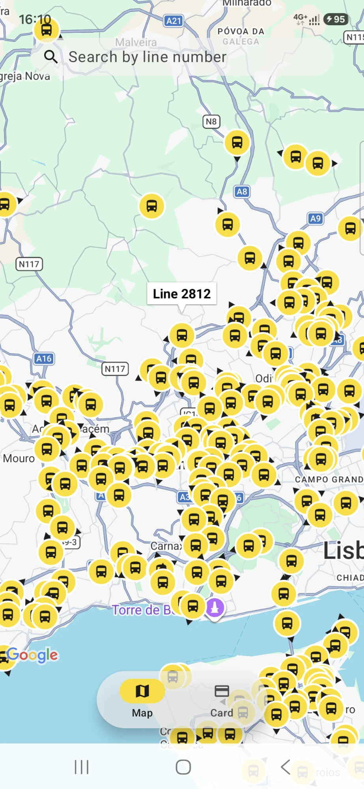
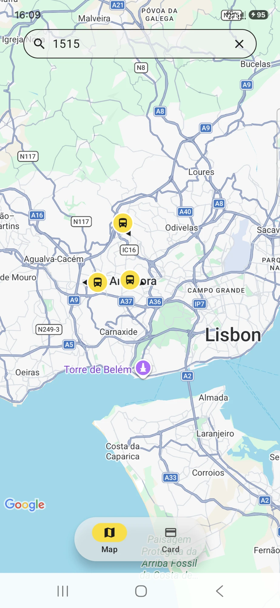
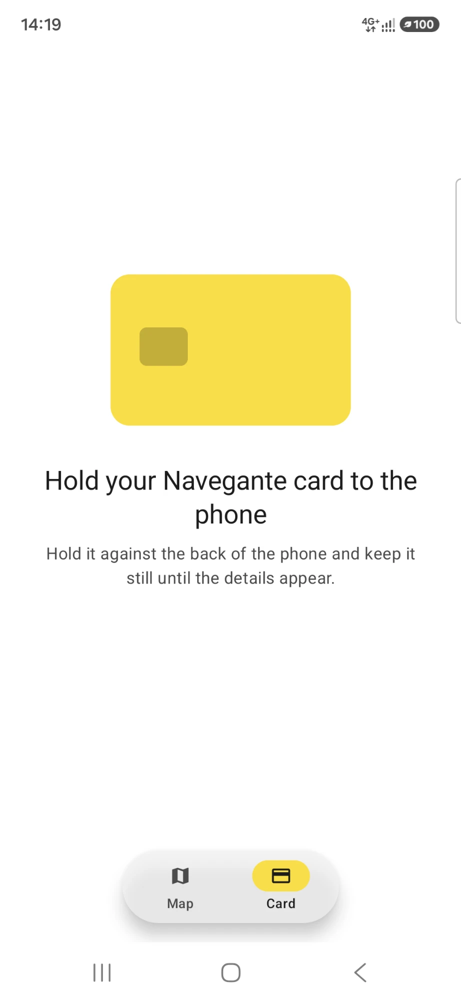
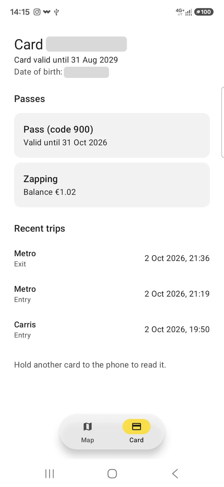

# Lisbonav

A Kotlin Multiplatform app for getting around Lisbon, for **Android and iOS** from one shared codebase.

- **Live bus map:** real-time positions of Carris Metropolitana buses on a map, with a search bar
  to show only one line.
- **Navegante card reader** *(Android)*: read Lisbon's contactless transit card over NFC
  (Calypso) and show its passes and recent trips.
- **Light and dark mode:** follows the system setting, including the map.

> Work in progress. See the [roadmap](#roadmap) for what's done.

## Screenshots

**Live bus map:** all buses in real time (tap one to see its line), and the search for one line.

<p>
  
  &nbsp;
  
</p>

**Navegante card reader:** waiting for a card, then the card's passes and recent trips
(the card number and date of birth are hidden).

<p>
  
  &nbsp;
  
</p>

## Tech stack

| Concern | Library |
|---|---|
| Shared code | Kotlin Multiplatform (Android + iOS) |
| UI | Compose Multiplatform |
| Map | Google Maps (Maps Compose) on Android, Apple MapKit on iOS |
| Networking | Ktor (OkHttp engine on Android, Darwin on iOS) |
| JSON | kotlinx.serialization |
| Dependency injection | Koin |
| Tests | kotlin.test, kotlinx-coroutines-test, Ktor `MockEngine` |

## Data source

[Carris Metropolitana open data](https://github.com/carrismetropolitana): `GET https://api.carrismetropolitana.pt/v2/vehicles`

- Public, **no API key** needed.
- Returns all vehicles in service in one JSON array (no pagination); responses are cached for 5 s.

## Architecture

Clean Architecture with dependencies pointing inward:

```
presentation ──► domain ◄── data
                   ▲
                   di (Koin wires everything together)
```

```
app/                          # app shell: App() with LisbonavTheme, NavHost + floating bottom bar (Map | Card),
                              #   initKoin() (all modules), iOS "Shared" framework
feature/map/src/              # feature: live buses on a map
├── commonMain/…/feature/map/
│   ├── domain/
│   │   ├── model/            # Vehicle, GeoPoint, VehicleStatus (plain Kotlin)
│   │   ├── repository/       # VehicleRepository interface
│   │   └── usecase/          # GetVehiclesUseCase: hides buses 5+ min behind the rest of the feed
│   ├── data/                 # internal to the feature
│   │   ├── remote/           # Carris Metropolitana API (Ktor), DTOs
│   │   ├── mapper/           # DTO → domain (drops vehicles without a usable position)
│   │   └── repository/       # VehicleRepositoryImpl: errors returned as Result
│   ├── presentation/
│   │   ├── viewmodel/        # VehicleMapViewModel: polls every 10 s while the map is visible
│   │   └── ui/map/           # VehicleMapScreen + expect VehicleMap, search bar
│   └── di/                   # mapModule: all the feature's Koin bindings
├── androidMain/…/            # Google Maps VehicleMap, bus marker icons
└── iosMain/…/                # MapKit VehicleMap, bus marker images
feature/transport-card/        # feature: Navegante card reader
├── commonMain/…/
│   ├── data/                 # CalypsoTransportCardReader: calypso-nfc dump → domain model
│   ├── domain/               # TransportCard, passes, trips, ReadTransportCardUseCase (pass order)
│   ├── presentation/         # TransportCardViewModel + screen (waiting / reading / card / errors)
│   └── di/                   # transportCardModule
├── androidMain/…/            # NFC tap source (reader mode), "Open NFC settings"
└── iosMain/…/                # not supported yet (Core NFC later)
feature/consent/               # feature: analytics consent dialog on first launch (GDPR opt-in)
├── data/                     # DataStoreConsentRepository: the answer in the settings DataStore
├── domain/                   # AnalyticsConsent, apply rule (only "Allow" turns collection on)
└── presentation/             # ConsentViewModel + AnalyticsConsentDialog (shown by app over the first screen)
core/                         # shared non-UI code: createHttpClient(engine), OkHttp / Darwin engines,
                              #   the settings DataStore (one per app, file path per platform)
analytics/                    # analytics API: Analytics interface, events, no-op (the apps implement it; no dependencies)
systemdesign/                 # shared design system: LisbonavTheme, light + dark (components move here when 2+ features use them)
calypso-nfc/                  # SDK: read Calypso transit cards over NFC (no UI, no app types)
├── commonMain/               # CardTransport, APDUs (ISO 7816-4), CalypsoReader
└── androidMain/              # IsoDep transport, NFC reader mode (iOS Core NFC later)
androidApp/                   # Android entry point (LisbonavApp starts Koin)
iosApp/                       # iOS entry point (iOSApp.swift starts Koin)
```

- The **engine** is the only platform-specific networking piece. JSON, base URL and error
  handling are Ktor plugins in common code, so both platforms behave the same.
- Every API sits behind an **interface**, so the repository and ViewModels can be tested with fakes.
- **`:calypso-nfc`** is a separate SDK module: the app depends on it, never the other way round.
  It is read-only by design (writing to a card needs the operator's keys).

### Module structure

Features are separate modules, so new screens stay independent: `app` holds the navigation
(bottom bar Map | Card) and wiring, and each feature keeps its own data / domain / presentation
layers, including its screens and ViewModels. `:systemdesign` holds the theme (and components once
more than one feature shares them); `:core` shares non-UI code (HTTP client, engines).
`:analytics` is only an interface: Firebase has no KMP SDK, so `androidApp` (Kotlin) and `iosApp`
(Swift) implement it and pass it to `initKoin`.


### Card reader (NFC)

How the Navegante card reader is split between the app's layers and the `:calypso-nfc` SDK,
how the phone talks to the card (APDUs over NFC), and the steps to build it:


## Setup: Google Maps key (Android only)

iOS uses MapKit and needs no key. On Android, the map stays empty without a Google Maps key
(the app still builds and runs).

1. In [Google Cloud Console](https://console.cloud.google.com/), enable **Maps SDK for Android**
   and create an API key (a billing account is required; map loads in the Android SDK are free).
2. Restrict the key to **Android apps**: package `com.majidbahmani.lisbonav` and your signing
   certificate SHA-1 (`./gradlew :androidApp:signingReport`), and to the Maps SDK for Android API.
3. Add it to `local.properties` (gitignored, never committed):

       MAPS_API_KEY=your_key_here

   CI can set a `MAPS_API_KEY` environment variable instead.

A key inside an APK is not secret; the Android restriction is what protects it from misuse.

## Setup: Firebase Analytics (optional)

Without it the app builds and runs, and logs nothing. Collection is off until the user taps
**Allow** in the consent dialog shown on first launch.

1. In the [Firebase console](https://console.firebase.google.com/), add the Android app
   `com.majidbahmani.lisbonav` and the iOS app `com.majidbahmani.lisbonav.Lisbonav` (plus your
   `TEAM_ID` if you set one in `iosApp/Configuration/Config.xcconfig`) to your project.
2. Download `google-services.json` into `androidApp/` and `GoogleService-Info.plist` into
   `iosApp/iosApp/` (both gitignored, never committed).
3. Restrict the generated API keys in Google Cloud Console like the Maps key.

Events (outcomes only, never card data, search text or positions):

| Event | Parameter | Logged when |
|---|---|---|
| `screen_view` | `screen_name` = `map` / `card` | another tab is shown |
| `line_search` | `line_found` = `true` / `false` | the user stops typing a line number (2 s) |
| `map_load_error` | `reason` = `no_connection` / `service` | loading the buses starts failing (not on every retry) |
| `card_read` | `result` = `success` / `nfc_off` / `no_nfc` / `card_removed` / `not_navegante` | a card read ends |

To see `line_found`, `reason` and `result` in reports, add them as event-scoped custom dimensions
in Google Analytics (Admin → Custom definitions).

## Build & run

Requirements: Android Studio (with the Kotlin Multiplatform plugin), JDK 21 (requested by
`gradle/gradle-daemon-jvm.properties`), and Xcode for iOS.

```bash
# Android
./gradlew :androidApp:assembleDebug

# iOS: open iosApp/iosApp.xcodeproj in Xcode and run, or build from the command line
./gradlew :app:linkDebugFrameworkIosSimulatorArm64
```

Code style: [ktlint](https://pinterest.github.io/ktlint/) (Android Studio style, trailing commas
allowed) with the [Compose rules](https://mrmans0n.github.io/compose-rules/), through Spotless.

```bash
./gradlew spotlessApply   # format before committing
./gradlew spotlessCheck   # what CI will run
```

## Tests

Shared tests run on both platforms, without network access:

```bash
./gradlew :feature:map:testAndroidHostTest :feature:map:iosSimulatorArm64Test   # map feature
./gradlew :app:testAndroidHostTest :app:iosSimulatorArm64Test                   # app wiring (Koin graph)
./gradlew :feature:transport-card:testAndroidHostTest :feature:transport-card:iosSimulatorArm64Test   # card feature
./gradlew :core:testAndroidHostTest :core:iosSimulatorArm64Test                 # shared core
./gradlew :calypso-nfc:testAndroidHostTest :calypso-nfc:iosSimulatorArm64Test   # card SDK
```

## Roadmap

- [x] Vehicles API client and DTO (Ktor + kotlinx.serialization)
- [x] Dependency injection (Koin, platform HTTP engines)
- [x] Domain model, mapper and repository
- [x] ViewModel and map screen with live bus positions
- [ ] Request logging (debug only) and timeouts
- [ ] CI (GitHub Actions)
- [ ] Navegante card reader (NFC, Android first)
  - [x] `:calypso-nfc` SDK: transport, APDUs, raw read of a Calypso card
  - [x] Calypso parser (passes, trips, holder data where readable)
  - [x] Card screen in the app
  - [ ] iOS Core NFC
